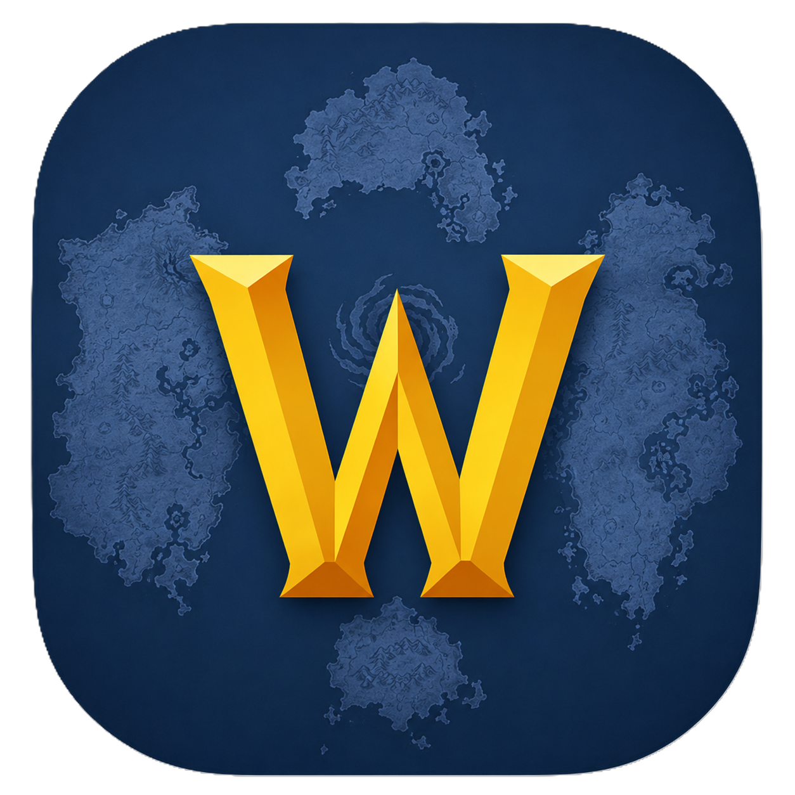

<!-- Improved compatibility of back to top link: See: https://github.com/othneildrew/Best-README-Template/pull/73 -->
<a id="readme-top"></a>

<!-- PROJECT SHIELDS -->
[]()
[]()
[]()
[](https://github.com/AlexandreColl/DnDMapBattle)

<br />
<div align="center">
  <a href="https://github.com/AlexandreColl/DnDMapBattle">
    
  </a>
  <h1 align="center">DnD Map Battle</h1>

  <p align="center">
    Simulador de batallas multijugador para Dungeons &amp; Dragons
    <br />
    <a href="#-funcionalidades"><strong>Explorar funcionalidades »</strong></a>
    <br />
    <br />
    <a href="#-multijugador">Ver Demo</a>
    &middot;
    <a href="https://github.com/AlexandreColl/DnDMapBattle/issues/new?labels=bug">Reportar Error</a>
    &middot;
    <a href="https://github.com/AlexandreColl/DnDMapBattle/issues/new?labels=enhancement">Solicitar Funcionalidad</a>
  </p>
</div>

<!-- TABLE OF CONTENTS -->
<details>
  <summary>Tabla de Contenidos</summary>
  <ol>
    <li>
      <a href="#about-the-project">Sobre el Proyecto</a>
      <ul>
        <li><a href="#built-with">Construido Con</a></li>
      </ul>
    </li>
    <li>
      <a href="#getting-started">Primeros Pasos</a>
      <ul>
        <li><a href="#prerequisites">Requisitos</a></li>
        <li><a href="#installation">Instalación</a></li>
      </ul>
    </li>
    <li><a href="#usage">Uso</a></li>
    <li><a href="#multiplayer">Multijugador</a></li>
    <li><a href="#roadmap">Roadmap</a></li>
    <li><a href="#contributing">Contribuir</a></li>
    <li><a href="#license">Licencia</a></li>
    <li><a href="#contact">Contacto</a></li>
    <li><a href="#acknowledgments">Agradecimientos</a></li>
  </ol>
</details>

<!-- ABOUT THE PROJECT -->
## Sobre el Proyecto

DnD Map Battle es una herramienta digital para Dungeon Masters que permite gestionar batallas tácticas sobre un mapa con cuadrícula. Los personajes se representan como fichas circulares con bordes de color personalizables, y el sistema incluye niebla de guerra con visión por personaje.

Todo funciona en local, sin cuentas ni servidores externos. La sincronización multijugador se realiza en tiempo real a través de WebSocket, permitiendo que el DM y los jugadores compartan la misma vista desde sus dispositivos conectados a la misma red WiFi.

Características principales:
* :joystick: Carga cualquier imagen como mapa y coloca fichas arrastrándolas
* :crossed_swords: Niebla de guerra híbrida: visión automática por personaje + revelado manual
* :satellite: Sincronización multijugador en tiempo real sin cuentas ni nube

<p align="right">(<a href="#readme-top">volver arriba</a>)</p>

### Construido Con

* [](https://developer.mozilla.org/en-US/docs/Web/HTML)
* [](https://developer.mozilla.org/en-US/docs/Web/CSS)
* [](https://developer.mozilla.org/en-US/docs/Web/JavaScript)
* [](https://nodejs.org/)
* [](https://socket.io/)

<p align="right">(<a href="#readme-top">volver arriba</a>)</p>

<!-- GETTING STARTED -->
## Primeros Pasos

Para obtener una copia local y ejecutarla, sigue estos pasos.

### Requisitos

* Node.js v18 o superior
* pnpm
  ```sh
  npm install -g pnpm
  ```

### Instalación

1. Clona el repositorio
   ```sh
   git clone https://github.com/AlexandreColl/DnDMapBattle.git
   cd DnDMapBattle
   ```
2. Instala las dependencias
   ```sh
   pnpm install
   ```
3. Inicia el servidor
   ```sh
   pnpm start
   ```

<p align="right">(<a href="#readme-top">volver arriba</a>)</p>

<!-- USAGE -->
## Uso

### Local (un solo PC)

Abre `index.html` directamente en el navegador, o inicia el servidor y visita `http://localhost:8080`.

1. **Carga un mapa** — selecciona cualquier imagen
2. **Genera la cuadrícula** — configura filas y columnas
3. **Añade personajes** — el editor convierte tus imágenes en fichas circulares con borde de color
4. **Arrastra las fichas al mapa** — colócalas en las celdas
5. **Gestiona la niebla** — los aliados destapan el mapa según su radio de visión

### Controles rápidos

| Acción | Entrada |
|--------|---------|
| Zoom | Rueda del ratón |
| Paneo | Arrastrar el fondo |
| Colocar personaje | Arrastrar del panel a una celda |
| Mover personaje | Arrastrar la ficha a otra celda |
| Destapar celda (permanente) | Clic central o `Shift + clic` |
| Ocultar panel | Botón `◀` en el borde del panel |

<p align="right">(<a href="#readme-top">volver arriba</a>)</p>

<!-- MULTIPLAYER -->
## Multijugador

Conecta tablets y móviles al mismo mapa en tiempo real.

1. Inicia el servidor (`pnpm start`)
2. La consola muestra la IP local:
   ```
   Red local: http://192.168.1.44:8080
   ```
3. Desde cualquier dispositivo en la misma WiFi, abre esa URL
4. Todos los cambios se replican instantáneamente

> [!NOTE]
> Si el firewall bloquea la conexión, permite el puerto 8080.

<p align="right">(<a href="#readme-top">volver arriba</a>)</p>

<!-- CONTRIBUTING -->
## Contribuir

Las contribuciones hacen que la comunidad open source sea un lugar increíble para aprender, inspirar y crear. **Cualquier contribución que hagas será muy apreciada.**

Si tienes una sugerencia que mejore el proyecto, por favor haz un fork del repositorio y crea un pull request. También puedes abrir un issue con la etiqueta "enhancement".

1. Haz un Fork del Proyecto
2. Crea tu Rama de Funcionalidad (`git checkout -b feature/AmazingFeature`)
3. Commit tus Cambios (`git commit -m 'feat: add some amazing feature'`)
4. Push a la Rama (`git push origin feature/AmazingFeature`)
5. Abre un Pull Request

<p align="right">(<a href="#readme-top">volver arriba</a>)</p>

<!-- LICENSE -->
## Licencia

Distribuido bajo la licencia MIT. Consulta `LICENSE` para más información.

<p align="right">(<a href="#readme-top">volver arriba</a>)</p>

<!-- CONTACT -->
## Contacto

Alexandre Coll Molina - [https://www.linkedin.com/in/alexandre-coll-molina/](https://www.linkedin.com/in/alexandre-coll-molina/)

Project Link: [https://github.com/AlexandreColl/DnDMapBattle](https://github.com/AlexandreColl/DnDMapBattle)

<p align="right">(<a href="#readme-top">volver arriba</a>)</p>
